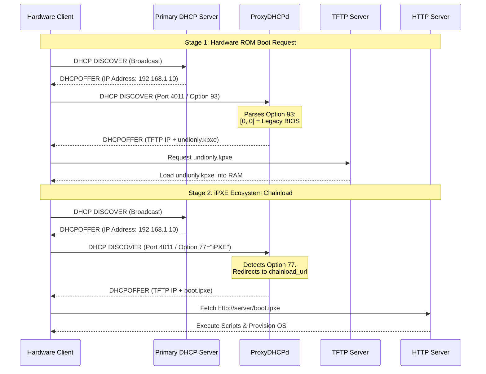

# ProxyDHCPd: The Zero-Configuration Network Boot Router

[](https://www.python.org/downloads/)
[](https://www.gnu.org/licenses/old-licenses/gpl-2.0.html)

**ProxyDHCPd** is a lightweight, strictly Python 3-native ProxyDHCP server built using an embedded fork of `pydhcplib`. It is designed to solve one of the most persistent headaches in systems administration: configuring complex PXE boot environments across multiple architectures without touching your organization's primary DHCP infrastructure or writing brittle regex rules in DNSmasq/ISC-DHCP.

Its "killer feature" is **out-of-the-box native iPXE chainloading** via strict RFC 4578 architecture whitelisting, preventing the legendary PXE infinite boot loop natively through a single `config.ini` file.

## Features

- **No Primary DHCP Modification**: Runs alongside your existing network assigning IPs, only responding to PXE boot requests on Port 4011/67.
- **Strict RFC 4578 Architecture Whitelisting (Option 93)**: Dynamically routes payloads based on the hardware requesting them (Legacy BIOS vs. EFI IA32 vs. EFI x86_64).
- **Native iPXE Chainloading (Option 77)**: Detects when the client is booting from iPXE and securely chainloads them to your final script (e.g., `boot.ipxe`), breaking the infinite loop automatically.
- **Single Source of Truth Configuration**: No complex regex required. Set your parameters in `[ipxe]` inside the `config.ini` file, and the daemon handles the routing.
- **Graceful Unsupported Drops**: Avoids DHCP server crashes by safely dropping unsupported ROM architecture (e.g., ARM64) payloads before encoding.

---

## The iPXE "Infinite Loop" Solved

When implementing iPXE, a common problem occurs: The initial hardware ROM requests a PXE payload and receives `undionly.kpxe`. The machine boots into iPXE, which immediately broadcasts *another* DHCP request. If the server isn't intelligent enough to distinguish between the hardware ROM and the software ROM, it sends `undionly.kpxe` again, creating an infinite loop.

ProxyDHCPd inspects the **User Class (Option 77)** to detect the `iPXE` signature, cleanly rerouting the secondary broadcast to your HTTP endpoint without you needing to write convoluted DHCP expressions.



---

## Installation & Requirements

ProxyDHCPd relies entirely on native Python 3 execution and includes its own internal fork of `pydhcplib`, meaning there are **zero external network dependencies** outside of the Python 3 standard library.

1. **Clone the repository:**
   ```bash
   git clone https://github.com/gmoro/proxyDHCPd.git
   cd proxyDHCPd
   ```

2. **System Requirements:**
   - Linux Operating System
   - Python 3.6+
   - Root privileges (to bind to restricted port 67)

---

## Configuration (`proxy.ini`)

ProxyDHCP is driven entirely by an INI configuration file. You do not need to learn complex templating to route your boot payloads.

```ini
[proxy]
listen_address=192.168.188.20
tftpd=192.168.188.20
# Specify the legacy fallback if [ipxe] isn't enabled
filename=undionly.kpxe
vendor_specific_information="proxyDHCPd"

### The Engine Room: Native iPXE Chainloading ###
[ipxe]
# Set to 'true' to dynamically break the infinite loop
enabled=true

# Stage 1: The Initial ROM Payloads (Option 93 Routing)
# If the machine is Legacy BIOS [0, 0], serve this file
legacy_bootstrap=undionly.kpxe
# If the machine is UEFI x64 [0, 7] or [0, 9], serve this file
efi_bootstrap=ipxe.efi

# Stage 2: The iPXE Chainload (Option 77 Routing)
# If the machine broadcast says "I am currently running iPXE",
# serve the final execution script.
chainload_url=boot.ipxe
```

---

## Development & Testing

We strictly enforce isolated environments for local development. **Do not run global `pip` installs.** 

To set up your sandbox and run the test suite, run the following commands sequentially:

```bash
# 1. Create a dedicated virtual environment
python3 -m venv venv

# 2. Activate the virtual environment
source venv/bin/activate

# 3. Install the testing and development dependencies
pip install -r requirements-dev.txt

# 4. Run the Pytest suite with missing lines and HTML report generated
pytest --cov=proxydhcpd.dhcpd --cov-report=term-missing --cov-report=html tests/

# 5. Exit the sandbox when done
deactivate
```

### CLI Usage

```
usage: proxydhcpd [-h] [-V] [-c FILE] [-d] [-p]

ProxyDHCPd — A proxy DHCP server in pure Python 3 with native iPXE chainloading.

options:
  -h, --help            show this help message and exit
  -V, --version         show program's version number and exit
  -c FILE, --config FILE
                        Path to the configuration file (default: /etc/proxyDHCPd/proxy.ini)
  -d, --daemon          Run as a background daemon via double-fork (ignored on Win32)
  -p, --proxy-only      Run only the ProxyDHCP server on port 4011 (skip port 67)
```

---

## Production Deployment (Systemd)

To run ProxyDHCPd securely in production, install the RPM package or `pip install .` and use the included hardened systemd unit:

```ini
[Unit]
Description=Python 3 Proxy DHCP Server
After=network.target

[Service]
Type=simple
# Hardened Security Defaults
DynamicUser=yes
AmbientCapabilities=CAP_NET_BIND_SERVICE
CapabilityBoundingSet=CAP_NET_BIND_SERVICE
ProtectSystem=strict
ProtectHome=yes
PrivateTmp=yes
PrivateDevices=yes
ProtectKernelModules=yes
ProtectKernelTunables=yes
ProtectControlGroups=yes
RestrictRealtime=yes
RestrictNamespaces=yes
LockPersonality=yes
NoNewPrivileges=yes

# We run as a regular service instead of using the built-in fork daemon (-d)
ExecStart=/usr/bin/proxydhcpd -c /etc/proxyDHCPd/proxy.ini
Restart=on-failure

[Install]
WantedBy=multi-user.target
```

Reload the daemon and enable it to start on boot:

```bash
sudo systemctl daemon-reload
sudo systemctl enable --now proxydhcpd
sudo systemctl status proxydhcpd
```
